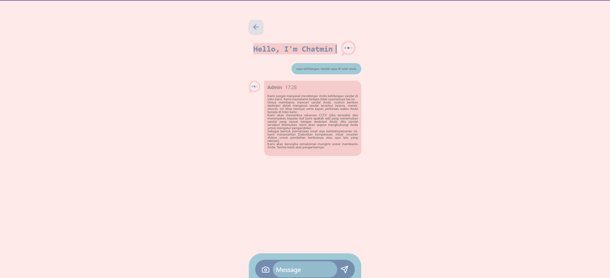

# 📣 Complaint Chat App

Complaint Chat adalah aplikasi web berbasis React yang memungkinkan pengguna menyampaikan keluhan atau pertanyaan secara langsung melalui antarmuka chat interaktif. Aplikasi ini dilengkapi dengan integrasi AI yang secara otomatis memberikan tanggapan terhadap keluhan pengguna secara cerdas dan kontekstual.

---

## 📝 Description
### Untuk Tugas Capstone Project IBM Granite X Hacktiv8

Aplikasi ini dirancang untuk membantu perusahaan atau organisasi menerima dan menanggapi komplain pelanggan secara otomatis. Dengan fitur chatbot AI, pengguna tidak hanya dapat menyampaikan keluhan, tetapi juga mendapatkan tanggapan cepat yang relevan.

---

## 🛠️ Technologies Used

- ⚛️ React (Frontend)
- 🧠 Gemini Flash
- 🎨 Tailwind CSS (UI styling)
- 🌐 Axios (HTTP requests)
- 🗃️ Node.js + Express (Backend)
- 🛡️ Dotenv (Environment Variables)

---

## ✨ Features

- 🗨️ Real-time complaint chat interface
- 🤖 AI-based automatic response using Gemini
- 🎨 Responsive and modern UI with Tailwind CSS
- 🔗 API integration with authentication token support

---

## 🚀 Setup Instructions

### 1. Clone repository
```bash
git clone https://github.com/arrizarisky/react-complaint-app.git
cd react-complaint-app
```
### 2. Install Frontend Dependencies
```bash
cd client
npm install
```
### 3. Install Backend Dependencies
```bash
cd ../server
npm install
```
### 4. Add .env in Server folder
buat file .env dan isi dengan:
```bash
REPLICATE_API_TOKEN=your_api_token_here
```
### 5. Run server
Masuk ke folder server lalu ketik ini:
```bash
npm run dev
```
### 6. Run Frontend
Masuk ke folder client lalu ketik ini:
```bash
npm run dev
```

# 🤖 AI Support Explanation

**Complaint Chat App** terintegrasi dengan model AI **Gemini Flash**. Model ini digunakan untuk:

- Memahami konteks dari keluhan yang diketik oleh user.
- Memberikan respons otomatis dalam gaya natural dan sopan.
- Menyediakan pengalaman customer service 24/7 berbasis AI.

### Kenapa tidak menggunakan IBM Granite? 
Tidak bisa digunakan karena terus terjadi error saat mencoba menggunakannya (Skill issue)

---

## 🔁 Proses

1. User mengirim pesan melalui chat interface.
2. Pesan dikirim ke backend **Node.js**.
3. Backend mengirimkan prompt ke **Gemini API**.
4. Respons dari model dikirim kembali ke frontend dan ditampilkan ke user.

---

## 📬 Contribution & Feedback

Silakan buka **issue** atau **pull request** untuk:

- Perbaikan bug  
- Saran fitur baru  
- Peningkatan performa  

---

## 📧 Kontak

`arrizarisky14@gmail.com`


## 🖼️ Demo App
### Get Started


###Chat AI Admin


